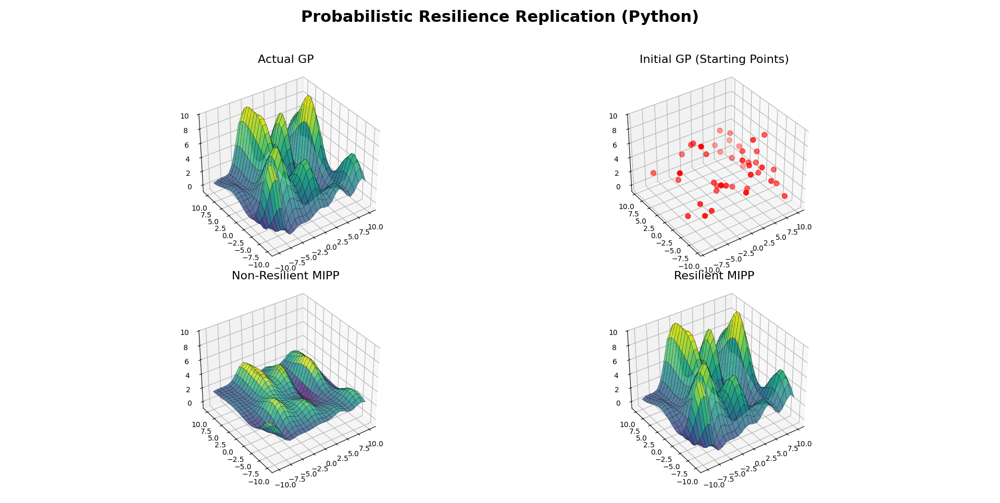

# Probabilistic Resilience Replication

This project is a Python-based replication of 3D resilience visualizations for the SCUBA Lab. It transitions original MATLAB-based Gaussian Process (GP) models into a modern Python environment.

## Project Overview
The repository contains scripts to parse `.mat` workspace files and render the following surfaces:
- **Actual GP:** The target environment model.
- **Initial GP:** Sparse initial observations (43 data points).
- **Non-Resilient MIPP:** Simulated system failure state.
- **Resilient MIPP:** Optimized resilient state.

## Installation & Setup
1. **Dependencies:**
   Ensure you have the following libraries installed:
   ```bash
   pip install numpy scipy matplotlib
   ## Replicated Results
